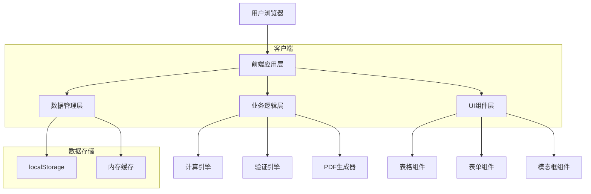

# 物流财务台账管理系统 - 技术架构文档

## 1. 系统架构设计

### 1.1 整体架构



### 1.2 技术选型

* **前端框架**: Vanilla JavaScript (ES6+)

* **UI框架**: Bootstrap 5 + 自定义CSS

* **图标库**: Bootstrap Icons

* **PDF生成**: jsPDF + html2canvas

* **构建工具**: Vite (可选，用于开发环境)

* **包管理**: npm (用于依赖管理)

### 1.3 项目结构

```
ANS-account/
├── index.html                 # 主页面
├── css/
│   ├── main.css              # 主样式
│   ├── components.css        # 组件样式
│   └── responsive.css        # 响应式样式
├── js/
│   ├── app.js                # 应用主入口
│   ├── config/
│   │   └── constants.js      # 常量配置
│   ├── modules/
│   │   ├── master-data.js    # 主数据管理
│   │   ├── ledger.js         # 台账管理
│   │   ├── calculation.js    # 计算引擎
│   │   ├── pdf-generator.js  # PDF生成
│   │   └── storage.js        # 存储管理
│   ├── components/
│   │   ├── table.js          # 表格组件
│   │   ├── form.js           # 表单组件
│   │   ├── modal.js          # 模态框组件
│   │   └── navigation.js     # 导航组件
│   └── utils/
│       ├── validation.js     # 验证工具
│       ├── format.js         # 格式化工具
│       └── helpers.js        # 辅助函数
└── data/
    └── sample-data.json      # 示例数据
```

## 2. 数据结构设计

### 2.1 localStorage数据架构

```javascript
// 主数据存储结构
const appData = {
    // 交易方主数据
    torihikisaki: {
        lastCode: "ANSC-010000",  // 最后使用的编码
        data: [
            {
                id: "uuid-1",
                torihikisakiCd: "ANSC-010001",
                companyName: "株式会社富士",
                kubun: ["顧客", "仕入先"],
                tel: "022-221-2109",
                postalCode: "980-0021",
                address: "宮城県仙台市青葉区本町2-3-1",
                houjinNo: "5370001007432",
                tanto: "田中太郎",
                defaultShiharaiJokenId: "uuid-payment-1",
                createdAt: "2025-01-01T00:00:00Z",
                updatedAt: "2025-01-01T00:00:00Z"
            }
        ]
    },
    
    // 费用项目主数据
    hiyoKoumoku: {
        data: [
            {
                id: "uuid-fee-1",
                koumokuName: "海上運賃立替費用",
                koumokuCode: "BL LATE PICK FEE",
                currency: "JPY",
                tani: "件",
                zeiKubun: "免税",  // or "課税"
                bikou: "",
                createdAt: "2025-01-01T00:00:00Z"
            }
        ]
    },
    
    // 支付条件主数据
    shiharaiJoken: {
        data: [
            {
                id: "uuid-payment-1",
                jokenName: "月末締め翌月末払い",
                kubun: "締日",  // or "天数計算"
                shimebi: 31,
                shiharaiKigen: "次月/31日",
                tensuu: null,
                status: "有効",
                createdAt: "2025-01-01T00:00:00Z"
            }
        ]
    },
    
    // 台账数据
    daicho: {
        lastNumber: "ANS-250100001",
        data: [
            {
                id: "uuid-ledger-1",
                daichoNo: "ANS-250100001",
                kokyakuId: "uuid-1",
                honsenName: "RUI HANG TENG FEI",
                koji: "L2516E",
                blNo: "SITGWUYOS12348",
                hinmei: "1300 CARTON(S)",
                funakaisha: "SITC",
                ctnrNo: "40HQx1",
                etd: "2025-08-15",
                eta: "2025-08-31",
                pol: "SHANGHAI,CHINA",
                pod: "YOKOHAMA,JAPAN",
                suuryou: "1300 CARTON(S)",
                juryou: "5,590.000KGS",
                youseki: "61.442m3",
                kyokaNo: "216 2281 6600",
                invNo: "25NFCC6148",
                bikou: "",
                createdAt: "2025-01-01T00:00:00Z",
                updatedAt: "2025-01-01T00:00:00Z"
            }
        ]
    },
    
    // 子发票数据
    koSeikyu: {
        data: [
            {
                id: "uuid-child-1",
                parentDaichoId: "uuid-ledger-1",
                seikyuNo: "ANS-250100001-A",
                kessaiTaniId: "uuid-1",
                seikyuKubun: "通常請求",  // or "立替請求"
                seikyuDate: "2025-09-30",
                shiharaiKigen: "2025-11-10",
                bikou: "",
                status: "未確認",  // 未確認/確認済/請求済/入金済
                createdAt: "2025-01-01T00:00:00Z",
                updatedAt: "2025-01-01T00:00:00Z"
            }
        ]
    },
    
    // 收费明细
    shuhiMeisai: {
        data: [
            {
                id: "uuid-income-1",
                koSeikyuId: "uuid-child-1",
                koumokuId: "uuid-fee-1",
                suuryou: 1,
                tani: "件",
                kubun: "免税",
                currency: "JPY",
                tanka: 233376,
                rate: 1,
                kingaku: 233376,
                bikou: "",
                createdAt: "2025-01-01T00:00:00Z"
            }
        ]
    },
    
    // 付费明细
    fuhiMeisai: {
        data: [
            {
                id: "uuid-expense-1",
                koSeikyuId: "uuid-child-1",
                koumokuId: "uuid-fee-1",
                shitatsukeSeikyuDate: "2025-09-30",
                kessaiTaniId: "uuid-2",
                suuryou: 1,
                tani: "件",
                kubun: "免税",
                currency: "JPY",
                tanka: 180000,
                rate: 1,
                kingaku: 180000,
                bikou: "",
                createdAt: "2025-01-01T00:00:00Z"
            }
        ]
    }
};
```

### 2.2 数据操作接口

```javascript
// 存储管理模块
class StorageManager {
    constructor() {
        this.storageKey = 'ans_accounting_data';
    }
    
    // 获取所有数据
    getAllData() {
        const data = localStorage.getItem(this.storageKey);
        return data ? JSON.parse(data) : this.getDefaultData();
    }
    
    // 保存数据
    saveData(data) {
        localStorage.setItem(this.storageKey, JSON.stringify(data));
    }
    
    // 获取指定类型的数据
    getData(type, id = null) {
        const allData = this.getAllData();
        if (id) {
            return allData[type]?.data?.find(item => item.id === id);
        }
        return allData[type]?.data || [];
    }
    
    // 添加数据
    addData(type, item) {
        const allData = this.getAllData();
        if (!allData[type]) {
            allData[type] = { data: [] };
        }
        item.id = this.generateUUID();
        item.createdAt = new Date().toISOString();
        allData[type].data.push(item);
        this.saveData(allData);
        return item.id;
    }
    
    // 更新数据
    updateData(type, id, updates) {
        const allData = this.getAllData();
        const index = allData[type]?.data?.findIndex(item => item.id === id);
        if (index !== -1) {
            allData[type].data[index] = {
                ...allData[type].data[index],
                ...updates,
                updatedAt: new Date().toISOString()
            };
            this.saveData(allData);
            return true;
        }
        return false;
    }
    
    // 删除数据
    deleteData(type, id) {
        const allData = this.getAllData();
        if (allData[type]?.data) {
            allData[type].data = allData[type].data.filter(item => item.id !== id);
            this.saveData(allData);
            return true;
        }
        return false;
    }
    
    // 生成UUID
    generateUUID() {
        return 'xxxxxxxx-xxxx-4xxx-yxxx-xxxxxxxxxxxx'.replace(/[xy]/g, function(c) {
            const r = Math.random() * 16 | 0;
            const v = c === 'x' ? r : (r & 0x3 | 0x8);
            return v.toString(16);
        });
    }
}
```

## 3. 核心算法实现

### 3.1 编码生成算法

```javascript
// 交易方编码生成
function generateTorihikisakiCode(lastCode) {
    const prefix = "ANSC-";
    const lastNumber = parseInt(lastCode.replace(prefix, ""));
    const newNumber = lastNumber + 1;
    return prefix + newNumber.toString().padStart(6, '0');
}

// 台账编号生成
function generateDaichoNo(lastNumber) {
    const prefix = "ANS-";
    const year = new Date().getFullYear().toString().slice(-2);
    const month = (new Date().getMonth() + 1).toString().padStart(2, '0');
    
    if (lastNumber) {
        const lastSeq = parseInt(lastNumber.slice(-4));
        const newSeq = (lastSeq + 1).toString().padStart(4, '0');
        return prefix + year + month + newSeq;
    }
    
    return prefix + year + month + "0001";
}

// 子发票编号生成
function generateChildInvoiceNumber(parentNumber, index) {
    const suffix = String.fromCharCode(65 + index); // A, B, C...
    return `${parentNumber}-${suffix}`;
}
```

### 3.2 支付期限计算

```javascript
// 支付期限计算
function calculateShiharaiKigen(seikyuDate, shiharaiJoken) {
    const date = new Date(seikyuDate);
    
    if (shiharaiJoken.kubun === '締日') {
        // 获取下个月的第一天
        const nextMonth = new Date(date.getFullYear(), date.getMonth() + 1, 1);
        // 设置指定日期
        const targetDate = new Date(nextMonth.getFullYear(), nextMonth.getMonth(), shiharaiJoken.shimebi);
        return targetDate.toISOString().split('T')[0];
    } else if (shiharaiJoken.kubun === '天数計算') {
        // 添加指定天数
        const targetDate = new Date(date);
        targetDate.setDate(targetDate.getDate() + shiharaiJoken.tensuu);
        return targetDate.toISOString().split('T')[0];
    }
    
    return seikyuDate;
}
```

### 3.3 金额计算引擎

```javascript
// 金额计算引擎
class CalculationEngine {
    // 计算单行金额
    calculateRowAmount(tanka, suuryou, rate = 1) {
        return Math.round(tanka * suuryou * rate);
    }
    
    // 计算子发票汇总
    calculateInvoiceSummary(koSeikyuId, shuhiData, fuhiData) {
        // 收费汇总
        const shuhiMenzekiGoukei = shuhiData
            .filter(item => item.kubun === '免税')
            .reduce((sum, item) => sum + item.kingaku, 0);
            
        const shuhiKazeiTaiouGoukei = shuhiData
            .filter(item => item.kubun === '課税')
            .reduce((sum, item) => sum + item.kingaku, 0);
            
        const shuhiShouhizei = Math.round(shuhiKazeiTaiouGoukei * 0.1);
        const shuhiGoukei = shuhiMenzekiGoukei + shuhiKazeiTaiouGoukei + shuhiShouhizei;
        
        // 付费汇总
        const fuhiMenzekiGoukei = fuhiData
            .filter(item => item.kubun === '免税')
            .reduce((sum, item) => sum + item.kingaku, 0);
            
        const fuhiKazeiTaiouGoukei = fuhiData
            .filter(item => item.kubun === '課税')
            .reduce((sum, item) => sum + item.kingaku, 0);
            
        const fuhiShouhizei = Math.round(fuhiKazeiTaiouGoukei * 0.1);
        const fuhiGoukei = fuhiMenzekiGoukei + fuhiKazeiTaiouGoukei + fuhiShouhizei;
        
        // 毛利计算
        const arariZeiNuki = (shuhiMenzekiGoukei + shuhiKazeiTaiouGoukei) - (fuhiMenzekiGoukei + fuhiKazeiTaiouGoukei);
        const arariZeiKomi = shuhiGoukei - fuhiGoukei;
        
        return {
            shuhiMenzekiGoukei,
            shuhiKazeiTaiouGoukei,
            shuhiShouhizei,
            shuhiGoukei,
            fuhiMenzekiGoukei,
            fuhiKazeiTaiouGoukei,
            fuhiShouhizei,
            fuhiGoukei,
            arariZeiNuki,
            arariZeiKomi
        };
    }
    
    // 验证计算结果
    validateCalculation(data) {
        const errors = [];
        
        // 检查负数
        if (data.shuhiGoukei < 0) errors.push('收费合计不能为负数');
        if (data.fuhiGoukei < 0) errors.push('付费合计不能为负数');
        
        // 检查税率计算
        const expectedShuhiShouhizei = Math.round(data.shuhiKazeiTaiouGoukei * 0.1);
        if (data.shuhiShouhizei !== expectedShuhiShouhizei) {
            errors.push('收费消费税计算错误');
        }
        
        return errors;
    }
}
```

## 4. 组件设计

### 4.1 表格组件

```javascript
// 可编辑表格组件
class EditableTable {
    constructor(containerId, options) {
        this.container = document.getElementById(containerId);
        this.options = {
            columns: [],
            data: [],
            editable: true,
            onRowAdd: null,
            onRowEdit: null,
            onRowDelete: null,
            ...options
        };
        this.init();
    }
    
    init() {
        this.render();
        this.bindEvents();
    }
    
    render() {
        const html = `
            <div class="table-responsive">
                <table class="table table-striped table-hover">
                    <thead class="table-dark">
                        <tr>
                            ${this.options.columns.map(col => `
                                <th>${col.title}</th>
                            `).join('')}
                            ${this.options.editable ? '<th>操作</th>' : ''}
                        </tr>
                    </thead>
                    <tbody id="${this.containerId}-tbody">
                        ${this.renderRows()}
                    </tbody>
                </table>
            </div>
            ${this.options.editable ? `
                <div class="mt-3">
                    <button class="btn btn-primary" id="${this.containerId}-add">
                        <i class="bi bi-plus"></i> 添加行
                    </button>
                </div>
            ` : ''}
        `;
        this.container.innerHTML = html;
    }
    
    renderRows() {
        return this.options.data.map((row, index) => `
            <tr data-row-index="${index}">
                ${this.options.columns.map(col => `
                    <td>${this.renderCell(row, col)}</td>
                `).join('')}
                ${this.options.editable ? `
                    <td>
                        <button class="btn btn-sm btn-warning edit-row" data-index="${index}">
                            <i class="bi bi-pencil"></i>
                        </button>
                        <button class="btn btn-sm btn-danger delete-row" data-index="${index}">
                            <i class="bi bi-trash"></i>
                        </button>
                    </td>
                ` : ''}
            </tr>
        `).join('');
    }
    
    renderCell(row, col) {
        const value = row[col.field];
        if (col.formatter) {
            return col.formatter(value, row);
        }
        return value || '';
    }
    
    bindEvents() {
        // 添加行
        const addBtn = document.getElementById(`${this.containerId}-add`);
        if (addBtn) {
            addBtn.addEventListener('click', () => {
                if (this.options.onRowAdd) {
                    this.options.onRowAdd();
                }
            });
        }
        
        // 编辑行
        this.container.addEventListener('click', (e) => {
            if (e.target.closest('.edit-row')) {
                const index = parseInt(e.target.closest('.edit-row').dataset.index);
                if (this.options.onRowEdit) {
                    this.options.onRowEdit(index);
                }
            }
        });
        
        // 删除行
        this.container.addEventListener('click', (e) => {
            if (e.target.closest('.delete-row')) {
                const index = parseInt(e.target.closest('.delete-row').dataset.index);
                if (confirm('确定要删除这行吗？')) {
                    if (this.options.onRowDelete) {
                        this.options.onRowDelete(index);
                    }
                }
            }
        });
    }
    
    updateData(newData) {
        this.options.data = newData;
        this.render();
    }
}
```

### 4.2 表单组件

```javascript
// 动态表单组件
class DynamicForm {
    constructor(containerId, options) {
        this.container = document.getElementById(containerId);
        this.options = {
            fields: [],
            data: {},
            onSubmit: null,
            onCancel: null,
            ...options
        };
        this.init();
    }
    
    init() {
        this.render();
        this.bindEvents();
    }
    
    render() {
        const html = `
            <form id="${this.containerId}-form">
                ${this.options.fields.map(field => this.renderField(field)).join('')}
                <div class="mt-4">
                    <button type="submit" class="btn btn-primary">保存</button>
                    <button type="button" class="btn btn-secondary" id="${this.containerId}-cancel">取消</button>
                </div>
            </form>
        `;
        this.container.innerHTML = html;
    }
    
    renderField(field) {
        const value = this.options.data[field.name] || '';
        const required = field.required ? 'required' : '';
        
        let inputHtml = '';
        
        switch (field.type) {
            case 'text':
            case 'number':
            case 'date':
            case 'email':
                inputHtml = `
                    <input type="${field.type}" 
                           class="form-control" 
                           id="${field.name}" 
                           name="${field.name}" 
                           value="${value}" 
                           ${required}
                           ${field.attributes || ''}>
                `;
                break;
                
            case 'select':
                inputHtml = `
                    <select class="form-select" id="${field.name}" name="${field.name}" ${required}>
                        <option value="">请选择</option>
                        ${field.options.map(opt => `
                            <option value="${opt.value}" ${value === opt.value ? 'selected' : ''}>
                                ${opt.text}
                            </option>
                        `).join('')}
                    </select>
                `;
                break;
                
            case 'checkbox':
                inputHtml = `
                    <div class="form-check">
                        <input type="checkbox" 
                               class="form-check-input" 
                               id="${field.name}" 
                               name="${field.name}" 
                               value="${field.value || '1'}"
                               ${value ? 'checked' : ''}>
                        <label class="form-check-label" for="${field.name}">
                            ${field.label}
                        </label>
                    </div>
                `;
                break;
                
            case 'textarea':
                inputHtml = `
                    <textarea class="form-control" 
                              id="${field.name}" 
                              name="${field.name}" 
                              rows="${field.rows || 3}" 
                              ${required}>${value}</textarea>
                `;
                break;
        }
        
        if (field.type === 'checkbox') {
            return `
                <div class="mb-3">
                    ${inputHtml}
                </div>
            `;
        }
        
        return `
            <div class="mb-3">
                <label for="${field.name}" class="form-label">
                    ${field.label}
                    ${field.required ? '<span class="text-danger">*</span>' : ''}
                </label>
                ${inputHtml}
                ${field.help ? `<div class="form-text">${field.help}</div>` : ''}
            </div>
        `;
    }
    
    bindEvents() {
        // 表单提交
        const form = document.getElementById(`${this.containerId}-form`);
        form.addEventListener('submit', (e) => {
            e.preventDefault();
            const formData = new FormData(form);
            const data = Object.fromEntries(formData.entries());
            
            // 验证
            if (this.validateForm(data)) {
                if (this.options.onSubmit) {
                    this.options.onSubmit(data);
                }
            }
        });
        
        // 取消按钮
        const cancelBtn = document.getElementById(`${this.containerId}-cancel`);
        if (cancelBtn) {
            cancelBtn.addEventListener('click', () => {
                if (this.options.onCancel) {
                    this.options.onCancel();
                }
            });
        }
    }
    
    validateForm(data) {
        const errors = [];
        
        this.options.fields.forEach(field => {
            if (field.required && !data[field.name]) {
                errors.push(`${field.label}是必填项`);
            }
            
            if (field.validation && data[field.name]) {
                const error = field.validation(data[field.name]);
                if (error) {
                    errors.push(error);
                }
            }
        });
        
        if (errors.length > 0) {
            alert(errors.join('\\n'));
            return false;
        }
        
        return true;
    }
    
    updateData(newData) {
        this.options.data = newData;
        this.render();
    }
}
```

## 5. 错误处理和边界情况

### 5.1 数据验证

```javascript
// 验证工具类
class ValidationUtils {
    // 邮政编码验证
    static validatePostalCode(code) {
        const pattern = /^\\d{3}-\\d{4}$/;
        return pattern.test(code);
    }
    
    // 法人番号验证
    static validateHoujinNo(no) {
        const pattern = /^\\d{13}$/;
        return pattern.test(no);
    }
    
    // 电话号码验证
    static validateTel(tel) {
        const pattern = /^\\d{2,4}-\\d{2,4}-\\d{4}$/;
        return pattern.test(tel);
    }
    
    // 日期逻辑验证
    static validateDateLogic(startDate, endDate) {
        if (!startDate || !endDate) return true;
        return new Date(endDate) >= new Date(startDate);
    }
    
    // 数值验证
    static validatePositiveNumber(value) {
        return !isNaN(value) && parseFloat(value) > 0;
    }
    
    // 必填项验证
    static validateRequired(value) {
        return value !== null && value !== undefined && value.toString().trim() !== '';
    }
}
```

### 5.2 错误处理

```javascript
// 错误处理管理器
class ErrorHandler {
    constructor() {
        this.errors = [];
    }
    
    addError(type, message, details = null) {
        const error = {
            id: Date.now(),
            type,
            message,
            details,
            timestamp: new Date().toISOString()
        };
        this.errors.push(error);
        this.showError(error);
    }
    
    showError(error) {
        // 显示错误提示
        const alertHtml = `
            <div class="alert alert-danger alert-dismissible fade show" role="alert">
                <strong>错误：</strong> ${error.message}
                ${error.details ? `<br><small>${error.details}</small>` : ''}
                <button type="button" class="btn-close" data-bs-dismiss="alert"></button>
            </div>
        `;
        
        // 将错误显示在页面顶部
        const alertContainer = document.getElementById('error-container') || this.createAlertContainer();
        alertContainer.insertAdjacentHTML('beforeend', alertHtml);
        
        // 自动移除错误
        setTimeout(() => {
            const alert = alertContainer.querySelector('.alert');
            if (alert) {
                const bsAlert = new bootstrap.Alert(alert);
                bsAlert.close();
            }
        }, 5000);
    }
    
    createAlertContainer() {
        const container = document.createElement('div');
        container.id = 'error-container';
        container.className = 'position-fixed top-0 start-50 translate-middle-x mt-3';
        container.style.zIndex = '9999';
        document.body.appendChild(container);
        return container;
    }
    
    clearErrors() {
        this.errors = [];
        const container = document.getElementById('error-container');
        if (container) {
            container.innerHTML = '';
        }
    }
    
    getErrors() {
        return this.errors;
    }
}
```

### 5.3 数据备份和恢复

```javascript
// 数据备份管理器
class DataBackupManager {
    constructor(storageManager) {
        this.storage = storageManager;
    }
    
    // 导出数据
    exportData() {
        const data = this.storage.getAllData();
        const exportData = {
            version: '1.0.0',
            exportDate: new Date().toISOString(),
            data: data
        };
        
        const blob = new Blob([JSON.stringify(exportData, null, 2)], {
            type: 'application/json'
        });
        
        const url = URL.createObjectURL(blob);
        const a = document.createElement('a');
        a.href = url;
        a.download = `ans_accounting_backup_${new Date().toISOString().split('T')[0]}.json`;
        document.body.appendChild(a);
        a.click();
        document.body.removeChild(a);
        URL.revokeObjectURL(url);
    }
    
    // 导入数据
    importData(file) {
        return new Promise((resolve, reject) => {
            const reader = new FileReader();
            
            reader.onload = (e) => {
                try {
                    const importData = JSON.parse(e.target.result);
                    
                    // 验证数据格式
                    if (!this.validateImportData(importData)) {
                        reject(new Error('导入的数据格式不正确'));
                        return;
                    }
                    
                    // 确认导入
                    if (confirm('导入数据将覆盖现有数据，是否继续？')) {
                        this.storage.saveData(importData.data);
                        resolve(true);
                    } else {
                        resolve(false);
                    }
                } catch (error) {
                    reject(new Error('解析导入文件失败：' + error.message));
                }
            };
            
            reader.onerror = () => {
                reject(new Error('读取文件失败'));
            };
            
            reader.readAsText(file);
        });
    }
    
    // 验证导入数据
    validateImportData(importData) {
        if (!importData.version || !importData.data) {
            return false;
        }
        
        // 检查必需的数据结构
        const requiredKeys = ['torihikisaki', 'hiyoKoumoku', 'shiharaiJoken', 'daicho', 'koSeikyu', 'shuhiMeisai', 'fuhiMeisai'];
        const dataKeys = Object.keys(importData.data);
        
        return requiredKeys.every(key => dataKeys.includes(key));
    }
    
    // 自动备份
    autoBackup() {
        // 每天自动备份一次
        const lastBackup = localStorage.getItem('last_auto_backup');
        const today = new Date().toDateString();
        
        if (lastBackup !== today) {
            try {
                this.exportData();
                localStorage.setItem('last_auto_backup', today);
                console.log('自动备份完成');
            } catch (error) {
                console.error('自动备份失败：', error);
            }
        }
    }
}
```

## 6. 性能优化策略

### 6.1 数据缓存

```javascript
// 数据缓存管理器
class DataCache {
    constructor() {
        this.cache = new Map();
        this.maxSize = 100;
    }
    
    set(key, data, ttl = 300000) { // 默认5分钟
        const item = {
            data,
            expiry: Date.now() + ttl
        };
        
        if (this.cache.size >= this.maxSize) {
            const firstKey = this.cache.keys().next().value;
            this.cache.delete(firstKey);
        }
        
        this.cache.set(key, item);
    }
    
    get(key) {
        const item = this.cache.get(key);
        
        if (!item) {
            return null;
        }
        
        if (Date.now() > item.expiry) {
            this.cache.delete(key);
            return null;
        }
        
        return item.data;
    }
    
    clear() {
        this.cache.clear();
    }
}
```

### 6.2 虚拟滚动

```javascript
// 虚拟滚动表格（用于大数据量展示）
class VirtualScrollTable {
    constructor(containerId, options) {
        this.container = document.getElementById(containerId);
        this.options = {
            data: [],
            rowHeight: 40,
            visibleRows: 20,
            columns: [],
            ...options
        };
        this.scrollTop = 0;
        this.startIndex = 0;
        this.endIndex = 0;
        this.init();
    }
    
    init() {
        this.render();
        this.bindEvents();
    }
    
    render() {
        const totalHeight = this.options.data.length * this.options.rowHeight;
        const visibleHeight = this.options.visibleRows * this.options.rowHeight;
        
        this.container.innerHTML = `
            <div class="virtual-scroll-container" style="height: ${visibleHeight}px; overflow-y: auto;">
                <div class="virtual-scroll-spacer" style="height: ${totalHeight}px;">
                    <div class="virtual-scroll-content" style="transform: translateY(${this.scrollTop}px);">
                        ${this.renderVisibleRows()}
                    </div>
                </div>
            </div>
        `;
    }
    
    renderVisibleRows() {
        this.startIndex = Math.floor(this.scrollTop / this.options.rowHeight);
        this.endIndex = Math.min(
            this.startIndex + this.options.visibleRows + 1,
            this.options.data.length
        );
        
        return this.options.data
            .slice(this.startIndex, this.endIndex)
            .map((row, index) => this.renderRow(row, this.startIndex + index))
            .join('');
    }
    
    renderRow(row, index) {
        return `
            <div class="virtual-scroll-row" style="height: ${this.options.rowHeight}px; line-height: ${this.options.rowHeight}px;">
                ${this.options.columns.map(col => `
                    <span style="display: inline-block; width: ${col.width || '100px'};">
                        ${col.formatter ? col.formatter(row[col.field]) : row[col.field]}
                    </span>
                `).join('')}
            </div>
        `;
    }
    
    bindEvents() {
        const container = this.container.querySelector('.virtual-scroll-container');
        container.addEventListener('scroll', (e) => {
            this.scrollTop = e.target.scrollTop;
            this.render();
        });
    }
}
```

## 7. 安全考虑

### 7.1 输入验证

```javascript
// XSS防护
function sanitizeInput(input) {
    const div = document.createElement('div');
    div.textContent = input;
    return div.innerHTML;
}

// SQL注入防护（虽然使用localStorage，但仍需防止恶意输入）
function validateInput(input, pattern) {
    if (pattern && !pattern.test(input)) {
        throw new Error('输入格式不正确');
    }
    return input;
}
```

### 7.2 数据加密（可选）

```javascript
// 简单的数据加密（用于敏感信息）
class DataEncryption {
    constructor(secretKey) {
        this.secretKey = secretKey;
    }
    
    encrypt(data) {
        // 简单的XOR加密
        let encrypted = '';
        for (let i = 0; i < data.length; i++) {
            encrypted += String.fromCharCode(
                data.charCodeAt(i) ^ this.secretKey.charCodeAt(i % this.secretKey.length)
            );
        }
        return btoa(encrypted); // Base64编码
    }
    
    decrypt(encryptedData) {
        try {
            const decoded = atob(encryptedData);
            let decrypted = '';
            for (let i = 0; i < decoded.length; i++) {
                decrypted += String.fromCharCode(
                    decoded.charCodeAt(i) ^ this.secretKey.charCodeAt(i % this.secretKey.length)
                );
            }
            return decrypted;
        } catch (error) {
            throw new Error('解密失败');
        }
    }
}
```

这个技术架构文档提供了完整的技术实现方案
